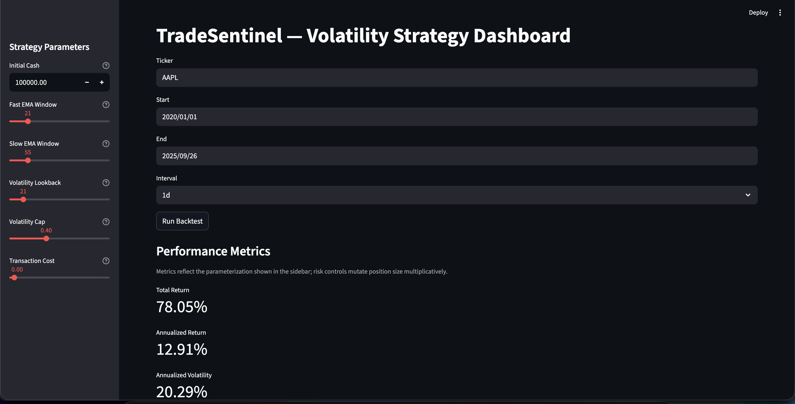
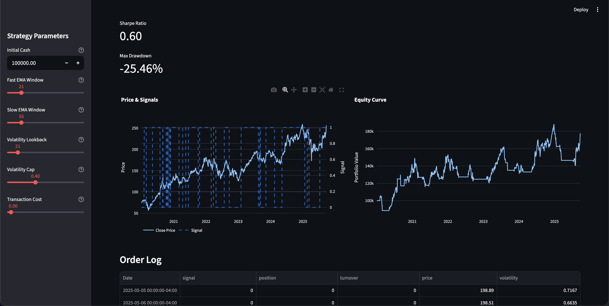

# TradeSentinel — Volatility Trading Dashboard

## Highlights
- **Reproducible volatility analytics**: Vectorized EMA + volatility-filter strategies run end-to-end with cached Yahoo Finance data for deterministic backtests.
- **Decision-ready insights**: Streamlit surfaces Sharpe, drawdown, and order flow so analysts can gauge risk before deploying capital.
- **Tested engineering core**: PyTest suite guards ingestion, indicator math, and portfolio logic to keep changes safe.

## UI Snapshot



## Overview
TradeSentinel is a Python-based trading dashboard that implements and evaluates algorithmic trading strategies with a focus on volatility and risk management.  
The system ingests market data from Yahoo Finance, applies technical indicators such as EMAs and volatility bands, backtests strategies, and presents results in a clean, interactive dashboard.  

The goal is to provide **transparent, reproducible analytics** that allow users to test strategies against historical data before moving to live environments.  

---

## Features
- **Deterministic Data Ingestion**: Pulls price history from Yahoo Finance using `yfinance` with parquet caching for repeatable runs.  
- **Indicators Module**: Computes EMAs, RSI, Bollinger Bands, and volatility measures.  
- **Backtester**: Simulates trade entry/exit rules, tracks portfolio state, and calculates key metrics (Sharpe ratio, max drawdown, total return).  
- **Dashboard**: Interactive visualization of signals, trades, and performance metrics via Streamlit.  
- **Testing**: Unit tests cover ingestion, indicator math, backtesting, and dashboard helpers.  

---

## Tech Stack
- **Languages**: Python (Pandas, NumPy)  
- **Data Handling**: Parquet caches via pandas/pyarrow  
- **Frameworks**: Streamlit for visualization  
- **Visualization**: Plotly for interactive charts  
- **Testing**: PyTest for unit coverage  

---

## Repository Structure  
Key directories:  
- `tradesentinel/` — core modules (`data_ingestion.py`, `indicators.py`, `backtester.py`, `dashboard.py`)  
- `tests/` — automated test suites  
- `docs/` — design docs and agent guidelines  
- `notebooks/` — exploratory prototyping  
- `data/` — cached datasets (gitignored)  

---

## Quickstart

### 1. Clone the repository
```bash
git clone https://github.com/yourusername/tradesentinel.git
cd tradesentinel
```
### 2. Setup environments
```bash
python3 -m venv venv
source venv/bin/activate
pip install -r requirements.txt
```
### 3. Run the test suite
```bash
pytest
```
### 4. Launch Dashboard
```bash
PYTHONPATH=. streamlit run tradesentinel/dashboard.py
```
